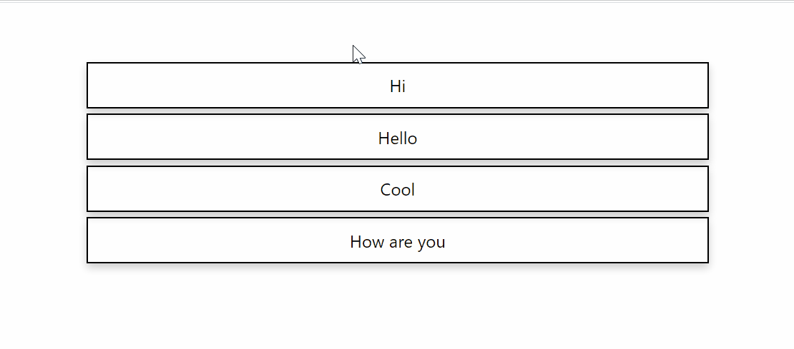
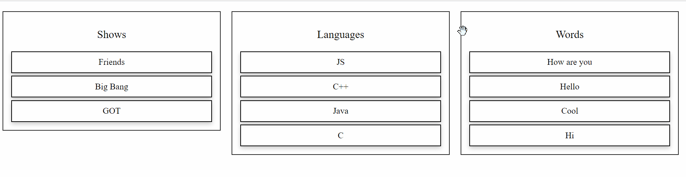

This is a simple React component that will enable you to reorder HTML elements. You can drag any component and change their position.

## Installation

Installation is done using the
[`npm install` command](https://docs.npmjs.com/getting-started/installing-npm-packages-locally):

```bash
$ npm install react-simple-reorder
```

### Example

Import `Draggable` from `react-simple-reorder` and wrap it between the components that you would like to drag and reorder.

```js
// ES6
import { Draggable } from "react-simple-reorder";
```

You would have to wrap the `Draggable` component to the components that you would like to reorder.

## Getting the current position and new position of element

| Props       | Description                | type                           |
| ----------- | -------------------------- | ------------------------------ |
| onPosChange | subscribe to change events | function (currentPos, newPos) |

### Example

```js
// src/examples/example1.tsx

import React, {useCallback} from "react";
import { Draggable } from "../lib";

const STATE = ["Hello", "Hi", "How are you", "Cool"];


export const Example1 = () => {
  const getChangedPos = useCallback((currentPos, newPos) => {
    console.log(currentPos, newPos);
  }, []);

  return (
    <div className="column">
      <Draggable onPosChange={getChangedPos}>
        {STATE.map((word, idx) => {
          return (
            <div key={`row-1-${idx}`} className="flex-item">
              {word}
            </div>
          );
        })}
      </Draggable>
    </div>
  )
}
```



## Nested reordering

This component supports nested reorderng. Note: if you drag a child to another parent, it will sort the parent components(!)

### Example

```js
// src/examples/example2.tsx

import React, {useCallback} from "react";
import { Draggable } from "../lib";

const STATE = {
  words: ["Hello", "Hi", "How are you", "Cool"],
  languages: ["C", "C++", "Java", "JS"],
  shows: ["GOT", "Friends", "Big Bang"],
};


export const Example2 = () => {
  const getChangedPos = useCallback((currentPos, newPos) => {
    console.log(currentPos, newPos);
  }, []);

  return (
    <div className="flex-container">
      <Draggable onPosChange={getChangedPos}>
        <div className="column">
          <p className="text">Words</p>
          <Draggable onPosChange={getChangedPos}>
            {STATE.words.map((word, idx) => {
              return (
                <div key={`row-1-${idx}`} className="flex-item">
                  {word}
                </div>
              );
            })}
          </Draggable>
        </div>
        <div className="column">
          <p className="text">Languages</p>
          <Draggable onPosChange={getChangedPos}>
            {STATE.languages.map((lng, idx) => {
              return (
                <div key={`row-2-${idx}`} className="flex-item">
                  {lng}
                </div>
              );
            })}
          </Draggable>
        </div>
        <div className="column">
          <p className="text">Shows</p>
          <Draggable onPosChange={getChangedPos}>
            {STATE.shows.map((lng, idx) => {
              return (
                <div key={`row-3-${idx}`} className="flex-item">
                  {lng}
                </div>
              );
            })}
          </Draggable>
        </div>
      </Draggable>
    </div>		
  )
}
```



## Reordering of custom components

If you want to add support of reordering a custom component (not a native HTML element), you will need to propagate the `props`
down the strea, as show below.

### Example

```js
// src/examples/example3.tsx

import React, {useCallback} from "react";
import { Draggable } from "../lib";

const STATE = ["Hello", "Hi", "How are you", "Cool"];

const WrappedComponent = (
  {
    className,
    word,
    ...props
  }:
  {
    word: string;
    className: string
  }
  ) => {

  return (
    <div className={`${className} highlighted`} {...props}>
      {word}
    </div>
  )
}

export const Example3 = () => {
  const getChangedPos = useCallback((currentPos, newPos) => {
    console.log(currentPos, newPos);
  }, []);

  return (
    <div className="column">
      <Draggable onPosChange={getChangedPos}>
        {STATE.map((word, idx) => {
          return <WrappedComponent key={`row-1-${idx}`} className="flex-item" word={word} />
        })}
      </Draggable>
    </div>
  )
}
```


Contributors are welcome ! :smiley:
